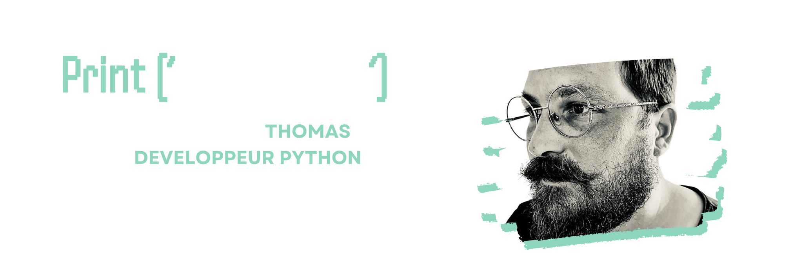

## À propos de moi

Salut ! Je m'appelle Thomas Savelli et je suis un développeur Python passionné basé en France, dans la région de la Haute-Corse. Possédant une expérience dans le développement web et celui de Software, avec une passion pour la création de solutions innovantes, je m'efforce de marier la logique du code avec l'esthétique du design.

### Compétences

- 🐍 Développeur Python, spécialisé dans les technologies web modernes et la conception de Software ainsi que d'API Restful.
- 💻 Expérience dans le développement avec Django et d'autres frameworks.
- 🛠️ Compétences supplémentaire en bases de données MySQL, SQLite, ainsi qu'en utilisation d'ORM.
- 🌐 Connaissances des technologies front-end telles que HTML5, CSS3, et un peu de JavaScript.
- 🚀 Passionné par l'automatisation des processus avec GitHub Actions et le déploiement avec Docker.

### Mes Projets récents :

📚 Book Online ETL - Mini Software de Scrapping Web 

Ce petit programme a pour objectif de faciliter la tâche de suivi des prix des livres d'occasion sur les sites web de concurrents de Books Online. Il s'agit d'un petit scraper développé en Python qui extrait les informations tarifaires d'autres librairies en ligne. Dans cette version bêta, le programme se concentre sur la récupération des prix chez un revendeur de livres en ligne nommé Books to Scrape, au moment de son exécution.

Lien vers le repository :
https://github.com/Thomas-Savelli/Books_Online_ETL.git

♟ Projestec - Software en ligne de commande 

Ce programme de Gestion de Tournois d'Échecs est une application simple et conviviale conçue pour aider les clubs d'échecs locaux à gérer efficacement leurs tournois. Contrairement aux solutions existantes, cette application fonctionne hors ligne, ce qui la rend idéale pour les tournois qui ne disposent pas d'une connexion Internet fiable.

Lien vers le repository :
https://github.com/Thomas-Savelli/association_echecs.git

🎬 JustStreamIt - Interface utilisateur web en Python depuis une API

Ce projet fut de créer une interface web en python pour la société JustStreamIt afin de référencer des films depuis une API à l’aide de requêtes ajax et de les afficher sur l'interface web.

Lien vers le repository :
https://github.com/Thomas-Savelli/juststreamit.git

💹 AlgoInvest&Trade : Résolution de problèmes d'investissements financiers

Ce programme est conçu pour AlgoInvest&Trade, une société financière spécialisée dans l'investissement. La société cherche à optimiser ses stratégies d'investissement à l'aide d'algorithmes, afin de dégager davantage de bénéfices pour ses clients.

Lien vers le repository : 
https://github.com/Thomas-Savelli/AlgoInvest-Trade_brutforce.git

📖 LITRevu - Application Web Django de critiques de Livres et d'Articles

Ce programme a pour objectif de faciliter la tâche de suivi des prix des livres d'occasion sur les sites web de concurrents de Books Online. Il s'agit d'un scraper développé en Python qui extrait les informations tarifaires d'autres librairies en ligne. Dans cette version bêta, le programme se concentre sur la récupération des prix chez un revendeur de livres en ligne nommé Books to Scrape, au moment de son exécution. L'application est développée pour être exécutable à la demande et ne surveille pas les prix en temps réel sur la durée. Il permettra à Books Online de gagner du temps et de rester compétitif sur le marché.

Lien vers le repository :
https://github.com/Thomas-Savelli/LITRevu.git

📊 SoftDesk - Création d'une API Rest

Le projet SoftDesk est une initiative visant à créer un backend robuste et sécurisé pour alimenter des applications frontend sur diverses plateformes. Cette API RESTful permettra de traiter et de gérer efficacement les données, offrant une expérience utilisateur optimale.

Lien vers le repository :
https://github.com/Thomas-Savelli/SoftDesk_API.git

🧪 Güdlft - Amélioration d'une application web par des tests et du débogage

Lien vers le repository :
https://github.com/Thomas-Savelli/Python_Testing.git

🕺🏻Epic Events - CRM Django, Création back-end sécurisé

Epic Events est une entreprise qui organise des événements (fêtes, réunions professionnelles,manifestations, ...) pour ses clients. EpicEvents-CRM (CustomerRelationship Management) permet de collecter et de traiter les données des clients et de leurs événements, tout en facilitant la communication entre les différents pôles de l'entreprise. Applicaton Django utilisable en ligne de commande grâce à des commandes personnalisées.

Lien vers le repository : 
https://github.com/Thomas-Savelli/Epic_Events_CRM.git

👨🏻‍💻 Orange County Lettings - Mise à échelle d'une application Web Django

Orange County Lettings est une start-up dans le secteur de la location de biens immobiliers. La start-up est en pleine phase d’expansion aux États-Unis. Elle souhaite améliorer son site tant sur le code que sur le déploiement.

Lien vers le repository :
https://github.com/Thomas-Savelli/orange-county-lettings.git

---

## Méthodes et Principes 🌟

En tant que développeur passionné, je suis un adepte de certaines méthodes cool et de principes sympas pour donner vie à mes projets ! Check it out 👇

### Méthodes de Développement

- **Agile 🏃‍♂️ :** Pour rester agile, flexible et garder le sourire pendant le dev !
- **TDD (Test-Driven Development) 🧪 :** Parce que les tests, c'est la base !
- **DDD (Domain-Driven Design) 🌐 :** Pour aligner le code avec le monde réel.

### Principes de Code

- **Code propre 🧹 :** KISS (Keep It Simple, Stupid) et DRY (Don't Repeat Yourself) sont mes mottos !
- **Principes SOLID 🌈 :**
  - **Responsabilité unique 🎭 :** Une raison de changer par classe.
  - **Ségrégation des interfaces 🚧 :** Des interfaces cool pour tous.

### Sécurité

- **Les 10 principaux risques de sécurité de l'OWASP 🕵️ :** Je suis les règles pour garder tout en sécurité !
- **RGPD (Règlement Général sur la Protection des Données) 🛡️ :** Parce que la vie privée, c'est important !

### Conventions de Codage

- **PEP 8 🐍 :** Je danse sur le rythme de PEP 8 pour un code Python funky.

---

## Comment me contacter

Si vous souhaitez discuter de projets passionnants, explorer des opportunités de collaboration ou simplement en savoir plus sur mon travail, n'hésitez pas à me contacter :

 

---
